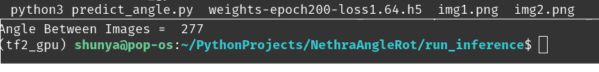

# Nehthra Assignment:  

#### Find the angle between TWO images.

### How to run InReference Code

#### Reproducing Dev environment
- I have used Tensoflow2 framework with Anaconda setup. Please find the 
[tf2_gpu.yml](https://github.com/kumarvis/NethraAngleRot/blob/main/tf2_gpu.yml) in repo to reproduce/import the environment.

#### Running Inference Script 

1. conda activate (env_name)
2. cd run_inference
3. python3 predict_angle.py (path to model wts) (path to img) [**If we are sure img1 is at ZERO angle**]
4. python3 predict_angle.py (path to model wts) (path to img1) (path to img2)

As per the our conversation over the email if we are sure the 
***FIRST Image or Reference Image is at ZERO degree then we can avoid the an extra argument(img2) I
T WILL HELP TO INCREASE ACCURACY.***

Download the [Model wts URL](https://drive.google.com/drive/folders/1qum2lUz4cupirWj4KApvfWN3xb99hPVN?usp=sharing)

 

  

